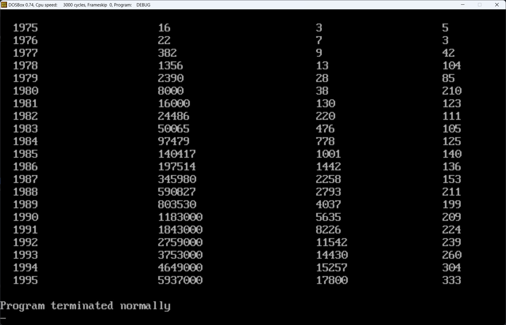

# Assumbly
汇编学习记录

## 实验十（P206）
源文件[10-4.asm](./10-4.asm) <br />


### 1.显示字符串
`show_str` <br />
功能：在指定位置，用指定颜色，显示一个用0结束的字符串 <br /><br />
参数：`(dh)`=行号(0\~24), `(dl)`=列号(0\~79), `(cl)`=颜色, `ds:si`指向字符串首地址 <br /><br />
返回：无 <br /><br />

属性字节的格式<br />
|7|6|5|4|3|2|1|0|
|-|-|-|-|-|-|-|-|
|BL||RGB||I||RGB|
|闪烁||背景||高亮||前景|

```asm
show_str:
        ; 将用到的寄存器压入栈中
        push ax
        push es
        push si
        push di
        push bx
        push dx
        push cx

        ; 设置显存位置
        mov ax,0b800h
        mov es,ax

        ; 计算行的首地址，行号X160，结果存放在ax中
        ; 用bx来表示行偏移量
        mov al,dh
        mov dh,160
        mul dh
        mov bx,ax

        ; di来表示列偏移量，列数乘2
        mov dh,0
        mov di,dx
        add di,di

        ; 用ax来保存每一个字符，ah为颜色，al为字符
        mov ah,cl
        mov cx,0
        s:
            mov cl,[si]
            jcxz return_a
            mov al,[si]
            mov es:[bx+di],ax
            inc si
            add di,2
            jmp short s

        return_a:
            pop cx
            pop dx
            pop bx
            pop di
            pop si
            pop es
            pop ax

            ret
```
### 2.解决除法溢出的问题
`divdw` <br />
功能：进行不会产生溢出的除法运算，被除数为dword型，除数为word型，结果为dword型 <br /><br />
参数：`(ax)` = dword型数据的低16位 <br />
      `(dx)` = dword型数据的高16位 <br />
      `(cx)` = 除数 <br /><br />
返回：`(dx)` = 结果的高16位，`(ax)` = 结果的低16位 <br />
      `(cx)` = 余数 <br /><br />
解决此问题可以使用如下公式：
```
X ÷ N = H / N * 10000H + (H % N * 10000H + L) ÷ N
X:被除数    N:除数    H:X的高16位    L:X的低16位
```
等式的右边分为加号左右两个部分：<br />
从整体上看，左边是一个数整除一个16位的数，结果为16位数，再乘以10000H，相当于位运算左移16位，变成了一个低16位全为0的32位数；右边为一个数除以16位的数，结果肯定为16位的数。左右相加，相当于将左边的结果放在高16位上，右边的结果放在低16位上。由此可知，加号左右两边分别为商的高16位和低16位。
```asm
divdw:
        push si
        push di

        mov si,ax ; 暂存低位
        mov di,dx ; 暂存高位
        
        mov ax,di
        mov dx,0
        div cx

        mov di,ax ; 结果的高16位
        mov ax,si 
        div cx
        
        ; 余数存入cx
        mov cx,dx
        mov dx,di

        pop di
        pop si

        ret
```
### 3.数值显示
`dtoc` <br />
功能：将word型数据转变为表示十进制数的字符串，字符串以0为结尾符 <br />
参数：`(ax)` = word型数据 <br />
      `ds:si`指向字符串首地址 <br />
返回：无 <br />
```asm
dtoc:
        push cx
        push bx
        push si
        push dx
        push di

        mov cx,0
        mov bx,10
        
        ; 先将一个‘0’压入栈中
        mov di,0
        push di
        inc di

        t:  
            div bx
            mov cx,ax

            ; 除10取余得到的是倒序的数，所以用到栈
            add dx,30h
            push dx
            inc di  ; 记录位数

            jcxz return_b
            mov dx,0
            
            jmp short t

        return_b:
            ; 将数字出栈到内存
            mov cx,di
            m:
                pop dx
                mov [si],dl
                inc si
                loop m

            pop di
            pop dx
            pop si
            pop bx
            pop cx

            ret
```

## 课程设计1（P211）
[design.asm](./design.asm) <br />


### 1.dword到字符串
`dwtostr` <br />
功能：将dword型数据转变为表示十进制数的字符串，字符串以0为结尾符 <br />
参数：`(ax)` = dword型数据的低16位 <br />
      `(dx)` = dword型数据的高16位 <br />
      `ds:si`指向字符串首地址 <br />
返回：无 <br />
```asm
dwtostr:
        push di
        push cx
        push dx
        push ax
        push si

        ; 先将一个‘0’压入栈中
        mov di,0
        push di
        inc di

        n:
            mov cx,10
            call divdw

            add cx,30h
            push cx
            inc di
            
            mov cx,0
            or cx,dx
            or cx,ax
            jcxz return_c

            jmp short n

        return_c:
            mov cx,di
            
            p:
                pop dx
                mov [si],dl
                inc si
                loop p

            pop si
            pop ax
            pop dx
            pop cx
            pop di

            ret
```

### 2.cls清空屏幕
`cls` <br />
功能：清空屏幕显示 <br />
参数：无 <br />
返回：无 <br />
遍历显存中彩色字符显示缓冲区第0页所用的160X25共4000个字节，将其均设为0以清空当前显示 <br />
```asm
    cls:
        push ax
        push ds
        push si
        push cx

        mov ax,00b800h
        mov ds,ax
        mov si,0
        mov cx,4000
        cc:
            mov word ptr [si],0
            add si,2
            loop cc

        pop cx
        pop si
        pop ds
        pop ax

        ret
```
### 3.数据处理
#### (1) 数据段的设置
在data段中，存放了所有的源数据，年份、总收入和雇员数分别声明在一起。 <br />
table段用来放置转换为字符串后的数据，每行数据占用32Byte，每行中不同数据用若干个字符占位。 <br />
```asm
data segment
    db '1975','1976','1977','1978','1979','1980','1981','1982','1983'
    db '1984','1985','1986','1987','1988','1989','1990','1991','1992'
    db '1993','1994','1995'

    dd 16,22,382,1356,2390,8000,16000,24486,50065,97479,140417,197514
    dd 345980,590827,803530,1183000,1843000,2759000,3753000,4649000,5937000
    
    dw 3,7,9,13,28,38,130,220,476,778,1001,1442,2258,2793,4037,5635,8226
    dw 11542,14430,15257,17800
data ends

table segment
    db 21 dup('year', 0, 'sum-----', 0, 'num-----', 0, '----', 0, 0, 0, 0, 0)
table ends
```

代码段主程序中设置数据段短地址时，将es指向data段，将ds指向table段，原因在于所有子程序在使用数据段时都是使用ds:si，将转换为字符串后的数据放入table段时，可以直接使子程序的结果放到ds:si中。 <br />
```asm
    mov ax,stack
    mov ss,ax
    mov sp,100h
    
    mov ax,table
    mov ds,ax

    mov ax,data
    mov es,ax
```
#### (2) 年份及总收入
利用循环进行处理，每次循环中，由于年份已经是字符串存储，就直接将年份复制到table段中的对应位置上。 <br />
此外由于年份和总收入的每条数据都是4Byte，用es:di处理时可以同时进行处理，处理收入时只需使用es:di+84即可访问到年份对应的总收入。 <br />
再设置参数令si指向table段中总收入对应位置，调用dwtostr子程序就能将总收入以字符串的形式保存到table段中。 <br />
不过由于我们让si每次都是指向每行的起始地址，在调用dwtostr时又需要将si设置到收入的位置，所以就需要在设置参数前将si入栈，调用子程序后再返回。 <br />
```asm
    ; 将年份复制到table段，收入处理后也放入table段
    mov si,0
    mov di,0
    mov cx,21
    year:
        ; 年份
        mov ax,es:[di]
        mov [si],ax
        mov ax,es:[di+2]
        mov [si+2],ax


        ; 处理收入
        mov ax,es:84[di]
        mov dx,es:84[di+2]

        ; ds段中用si来指向每一行数据起始位置，但是传入参数需要指向收入的起始位置，就先将其入栈，返回后恢复
        push si
        add si,5
        call dwtostr
        pop si

        add di,4
        add si,20h
        loop year
```
#### (3) 雇员数
```asm
    ; 将人数处理后放入table段
    mov si,14   ; 指向人数的起始位置
    mov di,168  ; 指向原数据中人数的起始位置
    mov cx,21
    num:
        ; 人数
        mov ax,es:[di]
        mov dx,0

        call dwtostr

        add si,20h
        add di,2
        loop num
```
#### (4) 计算人均收入
```asm
    ; 计算人均收入并放入table段
    mov si,23   ; 指向人均收入起始位置
    mov bx,84   ; 指向收入
    mov di,168  ; 指向人数
    mov cx,21
    per:
        ; 设置被除数
        mov ax,es:[bx]
        mov dx,es:[bx+2]
        ; 设置除数
        push cx
        mov cx,es:[di]
        call divdw
        pop cx

        call dwtostr

        add si,20h
        add bx,4
        add di,2

        loop per
```
##### (5) 显示结果
```asm
    ; 从第3行开始进行显示
    mov dh,3
    mov bx,0
    mov si,0
    mov cx,21
    display:
        push cx
        mov cl,7
        ; bx指向每行首位
        mov si,bx

        ; 第10列显示年份
        mov dl,2
        call show_str

        ; 第30列显示收入
        mov dl,25
        add si,5
        call show_str

        ; 第50列显示人数
        mov dl,50
        add si,9
        call show_str

        ; 第70列显示人均收入
        mov dl,70
        add si,9
        call show_str

        add bx,20h
        inc dh
        pop cx
        loop display
```
### 4.运行结果
 <br />